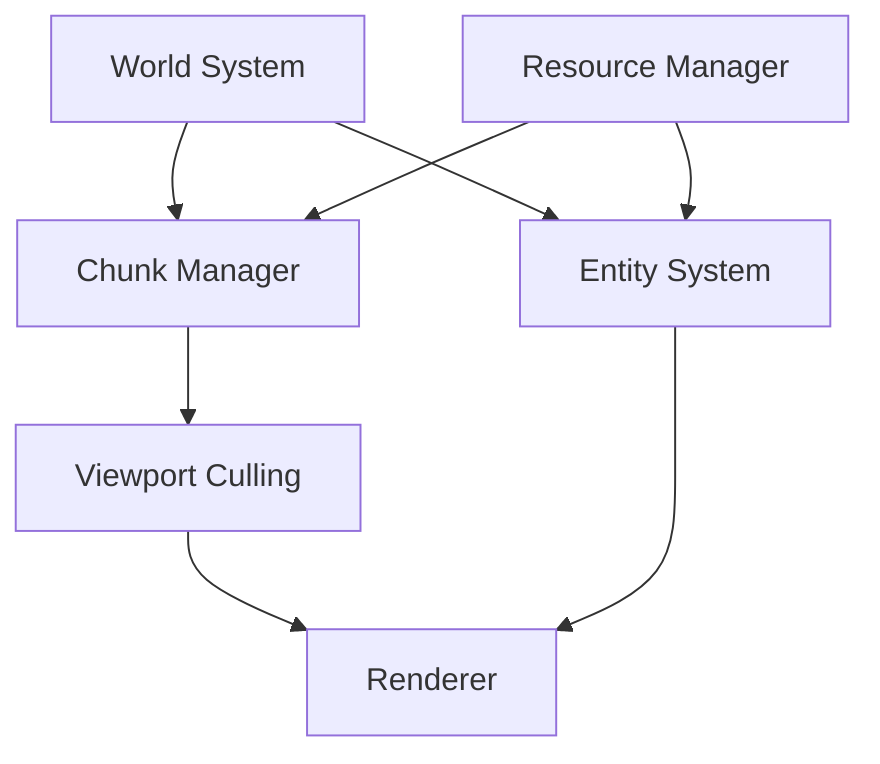

# Shadow Worker - Psychological RPG Architecture

## Core Concepts

### Psychological Framework
The game centers around a sophisticated psychological system that integrates:

1. **Personality Core**
   - Enneagram Types (1-9) with wings and stress/growth directions
   - DSM-5 dimensions with shadow integration
   - Development levels (1-9, healthy to unhealthy)

2. **Jungian Elements**
   - Archetypes (Persona, Shadow, Anima/Animus, Self, etc.)
   - Shadow projection and integration mechanics
   - Individuation progress tracking

3. **Psychological Resonance System**
   - States: GROUNDED → RESONATING → SYNCHRONIZED → TRANSCENDENT → UNIFIED
   - Emotional contagion and psychological influence mechanics
   - Collective consciousness connections

4. **Reality Perception Layers**
   - SURFACE → SUBCONSCIOUS → COLLECTIVE → INTEGRATED → TRANSFORMATIVE
   - Reality distortion and integration mechanics
   - Psychological manifestation system

### Core Systems

1. **PersonalityProfile Class**
   - Manages personality traits, states, and development
   - Handles psychological events and transformations
   - Tracks resonance and reality perception states

2. **World System**
   - Procedural room generation with psychological theming
   - Object and NPC placement based on psychological states
   - Environmental response to collective consciousness
   - Integration with `MapSystem` for map loading, updating, and rendering
   - Utilizes `TextureManager` for efficient texture handling

3. **Component System**
   - Manages entity components using a `ComponentRegistry`
   - Supports dynamic component addition and removal
   - Ensures memory-aligned component storage for performance
   - Implements size type safety with `SAFE_SIZE_T` and `SAFE_ARRAY_INDEX` macros
   - Uses aligned memory allocation for optimal cache usage
   - Provides boundary-checked array access and memory management
   - Supports automatic component array growth with safety checks
   - Implements efficient component removal with last-element swap

4. **Map Integration**
   - Handles map loading, updating, and rendering
   - Supports multiple render layers for complex scenes
   - Includes collision grid for spatial partitioning and collision detection

5. **Interaction System**
   - Ray-based interaction detection
   - Event-driven psychological influence
   - Reality manipulation through consciousness

## Technical Architecture

### Core Systems

1. **World System**
   - Manages the overall game world, including entities, tiles, and objects
   - Coordinates with the `MapSystem` and `TextureManager` for rendering
   - Provides functions for updating and drawing the world state

2. **Entity System**
   - Utilizes an `EntityPool` for efficient entity management
   - Supports component-based architecture with dynamic component handling
   - Provides functions for spawning, updating, and removing entities

3. **Map System**
   - Manages map data, including tiles, collision grids, and render layers
   - Provides functions for loading, updating, and rendering maps
   - Integrates with the `WorldSystem` for seamless map transitions

4. **Texture Management**
   - Utilizes a `TextureManager` for handling texture atlases and caching
   - Provides functions for loading and retrieving textures and regions
   - Ensures efficient texture usage across the game

5. **Interaction System**
   - Detects interactions using ray-based techniques
   - Triggers psychological events based on player actions
   - Allows for reality manipulation through player consciousness

### Memory Management

1. **Allocation Strategy**
```c
static void* SafeAlloc(size_t size) {
    void* ptr = calloc(1, size);
    if (!ptr) {
        TraceLog(LOG_ERROR, "Memory allocation failed");
        exit(1);
    }
    return ptr;
}
```

2. **Resource Cleanup**
```c
void UnloadResources(void) {
    // Unload textures
    for (int i = 0; i < textureCount; i++) {
        UnloadTexture(textures[i]);
    }
    
    // Unload audio
    for (int i = 0; i < waveCount; i++) {
        UnloadWave(waves[i]);
    }
    
    // Unload music
    for (int i = 0; i < musicCount; i++) {
        UnloadMusicStream(music[i]);
    }
}
```

### Validation Process

1. **Build Validation**
   - Clean build with zero warnings (-Werror enabled)
   - ASAN/UBSAN checks in debug builds
   - CMake configuration validation
   - Dependency verification

2. **Memory Alignment**
   - Structure alignment verification
   ```c
   static_assert(sizeof(World) % alignof(max_align_t) == 0, "World struct not properly aligned");
   static_assert(sizeof(Entity) % alignof(max_align_t) == 0, "Entity struct not properly aligned");
   static_assert(sizeof(EstateMap) % alignof(max_align_t) == 0, "EstateMap struct not properly aligned");
   ```
   - Padding optimization
   - Cache line alignment for critical structures

3. **Functional Testing**
   - Unit tests for all core systems
   ```c
   void run_map_tests(void) {
       test_map_creation();
       test_map_generation();
       test_spawn_points();
       test_map_tile_access();
   }
   ```
   - Integration tests for system interactions
   - Performance benchmarks for critical paths

4. **Memory Management**
   - Memory leak detection through ASAN
   - Resource cleanup verification
   - Allocation tracking in debug builds
   - Boundary checks on all array accesses

5. **Documentation Requirements**
   - All public APIs documented
   - Test coverage reports generated
   - Memory usage patterns documented
   - Performance characteristics noted

### Testing Infrastructure

1. **Unit Tests**
   - Core system validation
   - Edge case handling
   - Error condition testing
   - Performance benchmarking

2. **Integration Tests**
   - System interaction verification
   - Resource management validation
   - State transition testing
   - Error recovery validation

3. **Performance Tests**
   - Memory usage monitoring
   - CPU utilization tracking
   - Frame time analysis
   - Resource loading benchmarks

4. **Validation Tools**
   - Static analysis (clang-tidy)
   - Dynamic analysis (ASAN, UBSAN)
   - Memory profiling (Valgrind)
   - Performance profiling (perf)

## Implementation Status

### Completed
1. **Core Systems**
   - World system implementation
   - Estate map generation
   - Entity management
   - Resource handling
   - Memory management
   - Test infrastructure

2. **Validation**
   - Clean build process
   - Memory alignment verification
   - Core functionality testing
   - Memory leak detection
   - Documentation updates

### In Progress
1. **System Integration**
   - Entity interaction refinement
   - Resource optimization
   - Performance tuning
   - Test coverage expansion

2. **Advanced Features**
   - Psychological system implementation
   - Reality distortion effects
   - Visual effect system
   - Audio management

### Next Steps
1. **Feature Implementation**
   - Advanced NPC behaviors
   - Environmental interactions
   - Quest system integration
   - UI/UX improvements

2. **System Refinement**
   - Performance optimization
   - Memory usage reduction
   - Test coverage expansion
   - Documentation enhancement

## Development Guidelines

1. **Code Quality**
   - Follow SOLID principles
   - Maintain clean architecture
   - Write comprehensive tests
   - Document all public APIs

2. **Performance**
   - Profile critical paths
   - Optimize memory usage
   - Minimize allocations
   - Cache-friendly data structures

3. **Testing**
   - Write tests first (TDD)
   - Cover edge cases
   - Validate memory usage
   - Benchmark performance

4. **Documentation**
   - Keep docs up-to-date
   - Document design decisions
   - Include usage examples
   - Note performance characteristics

## System Overview

Shadow Worker is built on a modular architecture that emphasizes clean separation of concerns and maintainable code. The core systems are designed to work together while remaining independent and testable.

## Core Systems

### 1. World System
The foundation of the game environment, managing:
- Tile-based world representation
- Collision detection
- Resource management
- Entity management
- Camera control
- Physics interactions

#### Estate Map System
A specialized subsystem for generating and managing the estate layout:
- Procedural generation of estate layouts
- Tile and object placement
- Spawn point management
- Garden and decoration placement
- Path generation
- Water feature placement

### 2. Entity System
Handles all dynamic objects in the game:
- Player character
- NPCs
- Interactive objects
- Particle effects
- Collision detection
- State management

### 3. Resource Management
Centralizes asset handling:
- Texture loading and caching
- Sound management
- Memory optimization
- Asset cleanup

### 4. Rendering System
Manages all visual aspects:
- Tile rendering
- Entity rendering
- Particle effects
- UI elements
- Camera management
- Visual effects

### 5. Input System
Handles all user interaction:
- Keyboard input
- Mouse input
- Controller support
- Input mapping
- Event propagation

### 6. Sound System
Manages audio components:
- Sound effects
- Background music
- Spatial audio
- Volume control
- Audio streaming

## Data Structures

### World
```c
typedef struct World {
    TileType* tiles;
    TileProperties* tileProperties;
    Vector2 dimensions;
    EntityPool* entityPool;
    ResourceManager* resources;
    Camera2D* camera;
    Rectangle bounds;
    float globalResonance;
    float instabilityLevel;
    bool isStable;
    Vector2* spawnPoints;
    int spawnPointCount;
} World;
```

### Estate Map
```c
typedef struct EstateMap {
    World* world;
    Vector2* spawnPoints;
    int spawnPointCount;
} EstateMap;
```

## Key Features

### 1. Procedural Generation
- Estate layout generation
- Dynamic path creation
- Garden placement
- Object distribution
- Spawn point allocation

### 2. Psychological Elements
- Resonance system
- Reality distortion
- Mental state tracking
- Environmental responses
- NPC behavior adaptation

### 3. Environmental Interaction
- Dynamic lighting
- Weather effects
- Time system
- Environmental hazards
- Interactive objects

## File Structure

```
shadow-worker/
├── src/
│   ├── core/
│   │   ├── map.c          # Estate map implementation
│   │   ├── map.h          # Estate map interface
│   │   └── map_test.c     # Estate map unit tests
│   ├── entities/
│   ├── systems/
│   └── utils/
├── include/
│   ├── world.h
│   └── entity.h
├── resources/
│   ├── maps/
│   │   ├── tileset_main.png
│   │   └── tileset_config.json
│   └── objects/
└── docs/
    └── architecture.md
```

## Build System
- CMake-based build system
- Cross-platform compatibility
- Automated testing
- Resource management
- Development tools

## Testing Strategy
- Unit tests for core systems
- Integration tests
- Performance benchmarks
- Memory leak detection
- Automated test suite

## Future Considerations
- Enhanced procedural generation
- Advanced AI behaviors
- Extended environment interaction
- Additional psychological elements
- Performance optimizations

graph TD
    subgraph Project Structure
        Root --> Resources
        Root --> Source
        Root --> Documentation
        Root --> External

        Resources --> Maps
        Maps --> RoomTemplates
        RoomTemplates --> BasicRoom[basic_room.json]

        Source --> Core
        Source --> Systems
        Source --> Entities
        Source --> UI

        Core --> World
        Core --> Estate
        Core --> ResourceManager
        Core --> Camera

        Systems --> InputSystem
        Systems --> SoundSystem
        Systems --> RenderSystem
        Systems --> PhysicsSystem
        Systems --> PsychologicalSystem

        Entities --> Player
        Entities --> NPCs
        Entities --> Objects
        Entities --> Environment

        Documentation --> Architecture
        Documentation --> API
        Documentation --> Setup

        External --> Raylib
    end

    subgraph Data Structures
        World --> |contains| Tiles
        World --> |manages| EntityPool
        World --> |uses| Resources
        World --> |controls| Camera
        World --> |tracks| Resonance

        Estate --> |contains| World
        Estate --> |manages| SpawnPoints
        Estate --> |controls| Generation
    end

    subgraph Room Template Structure
        RoomDef[Room Definition] --> Layers
        RoomDef --> SpawnPoints
        RoomDef --> Connections
        RoomDef --> ResonancePoints
        RoomDef --> Properties

        Layers --> Background
        Layers --> Main
        Layers --> Foreground

        Properties --> AmbientResonance
        Properties --> ShadowIntensity
        Properties --> PsychologicalThreshold
    end
```

## Tile System
The tile system is a core component that handles world rendering and tile management:

#### Components
1. **Chunk Manager**
   - Handles 16x16 tile chunks
   - LRU cache with 64 chunk capacity
   - Automatic chunk loading/unloading
   - Texture caching for rendered chunks

2. **Viewport Culling**
   - Camera-based viewport tracking
   - Dynamic chunk loading based on visibility
   - Efficient grid-based calculations
   - Automatic dirty state management

3. **Property System**
   - Lightweight TMX-inspired properties
   - JSON-based custom properties
   - Core property set (walkable, destructible, etc.)
   - Dynamic memory management

4. **Integration Points**
   - World System: Chunk updates and tile state
   - Resource Manager: Texture handling
   - Physics System: Collision detection
   - Entity System: Object placement

### World Generation
- Procedural estate generation
- Room template system
- Object placement
- Spawn point management

### Entity System
- Component-based architecture
- Dynamic entity pooling
- Collision detection
- State management

### Resource Management
- Texture loading and caching
- Sound management
- Memory optimization
- Asset tracking

## Data Flow



## Memory Management

### Tile System
- Chunk textures: ~16KB per chunk
- Maximum cache: ~1MB (64 chunks)
- Custom properties: Dynamic allocation
- Viewport tracking: Negligible

### Entity System
- Entity pool: Pre-allocated
- Components: Cache-aligned
- State data: Dynamic

### Resource System
- Texture cache: Managed size
- Sound buffers: Streaming
- Asset references: Pooled

## Performance Considerations

### Rendering Pipeline
1. Viewport calculation
2. Chunk visibility check
3. Cache management
4. Texture rendering

### Memory Hierarchy
1. Active chunks (hot)
2. Entity data (warm)
3. Resource cache (cool)
4. Template data (cold)

### Optimization Strategies
1. Chunk size tuning
2. Cache policy adjustment
3. Property compression
4. Batch rendering

## Future Extensibility

### Planned Features
1. Multi-threaded chunk updates
2. Dynamic chunk sizing
3. Property inheritance
4. Compressed texture cache

### Integration Points
1. Lighting system
2. Particle effects
3. Weather system
4. Dynamic objects

# Architecture Documentation

## Core Systems

### Map System
The map system manages the game world's tile-based environment and object placement. Key components include:

- **TileMap**: Represents the game world grid with properties for each tile
- **MapSystem**: Manages map rendering, object placement, and chunk-based optimization
- **ChunkCache**: Implements efficient tile rendering through cached chunks
- **MapObjects**: Handles placement and management of interactive objects in the world

### Entity System
The entity system uses a component-based architecture for game objects:

- **EntityPool**: Manages entity lifecycle and provides efficient entity lookup
- **Components**: Modular pieces that define entity behavior
  - Transform: Position, rotation, and scale
  - Physics: Movement and collision
  - Render: Visual representation
  - Collider: Collision detection
  - AI: Non-player character behavior
  - PlayerControl: Player input handling

### Resource Management
The resource manager handles all game assets:

- **ResourceManager**: Central system for loading and managing game resources
- **TextureManager**: Handles texture loading and region management
- **SoundManager**: Manages audio resources and playback
- **FontManager**: Handles text rendering resources
- **ShaderManager**: Manages shader programs

## System Interactions

### Map-Entity Interaction
- Entities can interact with map objects through collision detection
- Map system provides spatial partitioning for efficient entity queries
- Object placement affects pathfinding and AI behavior

### Resource-Entity Binding
- Entities reference resources through the resource manager
- Dynamic resource loading based on entity requirements
- Resource sharing between similar entities

## Optimization Strategies

### Chunk-based Rendering
- Map divided into chunks for efficient rendering
- Only visible chunks are processed and rendered
- Chunk cache maintains recently used map sections

### Entity Pool Management
- Object pooling for efficient entity creation/destruction
- Spatial partitioning for collision detection
- Component-based architecture for memory efficiency

### Resource Management
- Lazy loading of resources
- Resource sharing between entities
- Automatic resource cleanup

## Future Considerations

### Planned Improvements
- Enhanced chunk management for large maps
- Dynamic resource streaming
- Advanced entity component system
- Improved collision detection algorithms