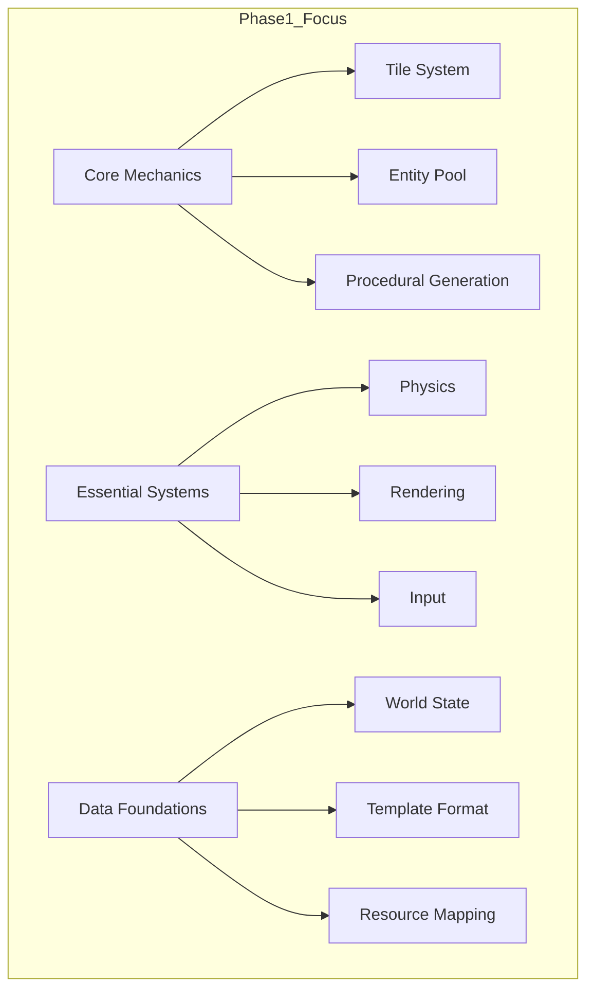

# Phase 1: Core Foundation Implementation
*(Lightweight Architecture for Future AI Psychology Expansion)*

## Simplified Project Scope


## Core Implementation Strategy

### 1. Minimal World Structure
```c
typedef struct World {
    // Core elements only
    TileType** tiles;
    Vector2 dimensions;
    EntityPool* entities;
    SpawnPoint* spawns;
    int spawnCount;
    Camera2D camera;
    // Added elements
    MapSystem mapSystem;
    TextureManager* textureManager;
    ComponentRegistry registry;
} World;
```

### 2. Simplified Room Template
```json
{
    "name": "basic_room",
    "type": "ROOM_BASE",
    "size": [40,30],
    "layers": {
        "terrain": "TILE_MATRIX_16x16",
        "decorations": "OVERLAY_8x8"
    },
    "spawn_rules": {
        "player": {"x": 20, "y": 15},
        "npcs": {"count": 2, "zones": [[10,10],[30,20]]}
    }
}
```

### 3. Enhanced Systems
- **Map System**: Manages map data, including tiles, collision grids, and render layers.
- **Texture Management**: Utilizes a `TextureManager` for handling texture atlases and caching.
- **Component System**: Manages entity components using a `ComponentRegistry`.

### 4. Data Foundations
- **World State Management**: Coordinates with the `MapSystem` and `TextureManager` for rendering.
- **Resource Mapping**: Ensures efficient resource usage across the game.

### 5. Procedural Generation Pipeline
1. Shape Generation → 2. Tile Assignment → 3. Entity Placement → 4. Validation

### 6. Phase 1 Algorithms
| Algorithm | Purpose | Complexity |
|-----------|---------|------------|
| Cellular Automata | Basic cave generation | Low |
| BSP Trees | Space partitioning | Medium |
| Random Walker | Path creation | Low |

## Implementation Steps

### 1. Tile System Foundation
```c
void InitTileSystem() {
    // Raylib-specific implementation
    tile_atlas = LoadTexture("tilesets/base.png");
    GenTextureMipmaps(&tile_atlas);
    SetTextureFilter(tile_atlas, TEXTURE_FILTER_TRILINEAR);
}
```

### 2. Basic World Generation
```c
World* GenerateWorld(int width, int height) {
    World* world = RL_MALLOC(sizeof(World));
    world->tiles = GenerateCaveLayout(width, height); // Cellular automata
    world->entities = CreateEntityPool(MAX_ENTITIES);
    world->spawns = CalculateSpawnPoints(world);
    return world;
}
```

### 3. Entity System Stubs
```c
// Psychology-ready placeholder
typedef struct Entity {
    Vector2 position;
    BehaviorProfile behavior; // Empty struct for future expansion
} Entity;
```

## Future-Proofing Measures

### 1. Data Structure Reservations
```c
typedef struct World {
    /* ... Phase 1 fields ... */
    void* psychologyData; // NULL until Phase 2
    void* resonanceBuffer; // Unused memory block
} World;
```

### 2. Template Compatibility
```json
{
    "metadata": {
        "phase": 1,
        "psychology_ready": false
    }
}
```

## Validation & Metrics

### Core Requirements
- 60 FPS rendering @ 1920x1080
- <1MB memory overhead for generation system
- Generation time <250ms for 64x64 maps

### Test Cases
```c
TEST("Basic Pathfinding") {
    World* test_world = LoadTestMap("tests/connectivity.json");
    REQUIRE(PathExists(test_world, START, END));
}

TEST("Entity Spawning") {
    World* world = GenerateWorld(40,30);
    REQUIRE(world->spawnCount >= MIN_SPAWNS);
}
```

This stripped-down implementation maintains all necessary hooks for AI psychology features while focusing Phase 1 efforts on:
- Stable core rendering/physics
- Expandable data structures
- Basic procedural generation
- Lightweight entity system